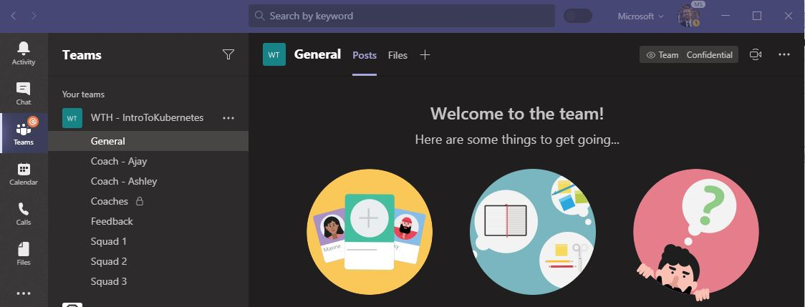
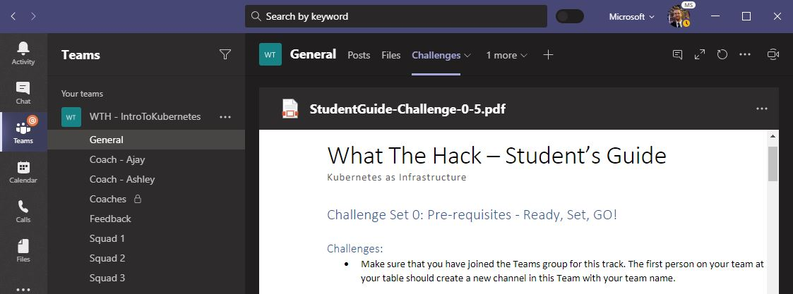
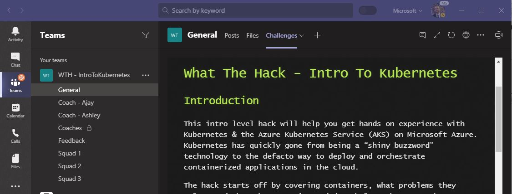
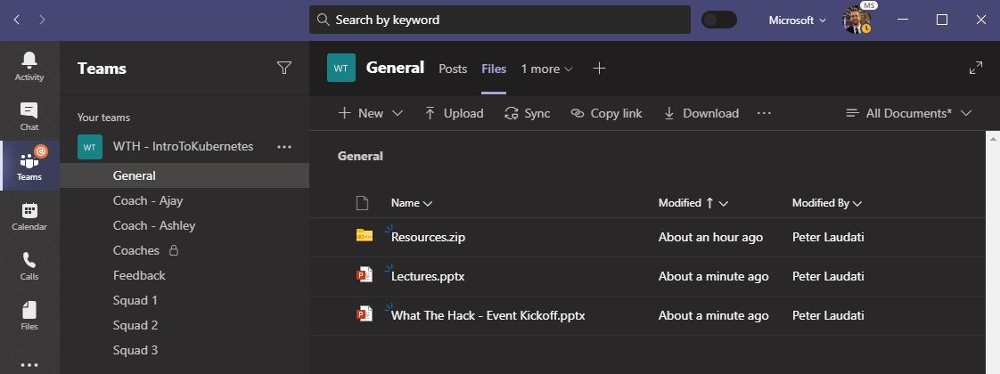
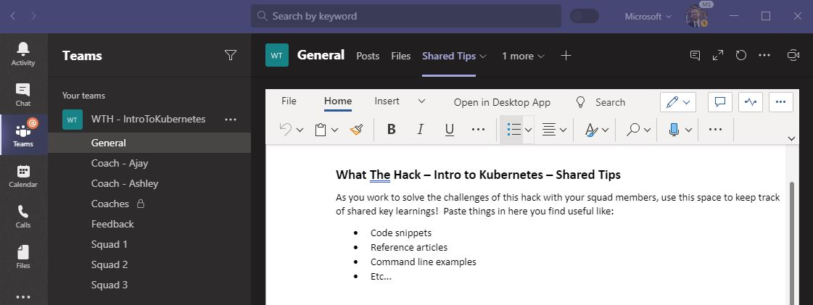
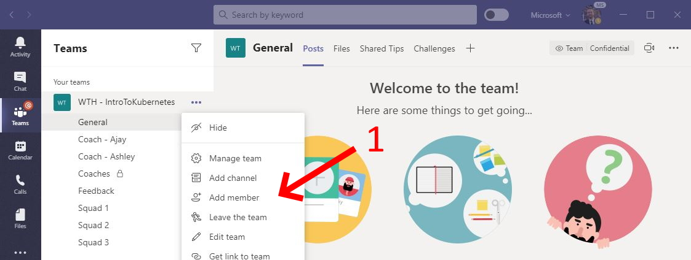
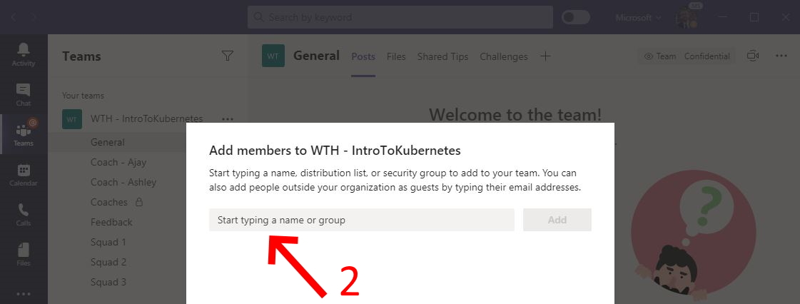
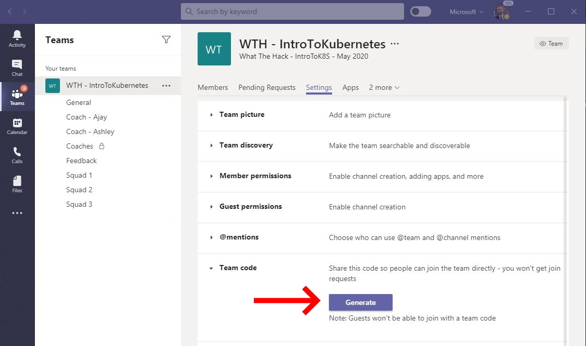

# How to Host a What The Hack

We've structured the What The Hack format to make it easy to deliver to students both in person and virtually. The following are instructions, tips and tricks to hosting your own What The Hack event and have it go off without a hitch. You may choose to adopt as much or little as you would like. This guidance has been cobbled together from experience based on what has worked before.

With the Covid-19 pandemic, virtual events will be the way of the future for some time. Participating in a team-based hands-on event virtually may be a new concept for many. However, we have found that virtual WTH events are often more collaborative than a traditional in-person event!

This document has the following sections:
- [WTH Event Requirements](#what-do-you-need-to-host-a-what-the-hack-event)
- [WTH Event Preparation](#event-preparation)
- [WTH Event Day](#event-day)
- [In-Person Event Tips](#tips-for-in-person)
- [Virtual Event Tips](#tips-for-virtual)

## What do you need to host a What The Hack event?

At minimum, three things:
1. [Hack Content](#hack-content)
1. [Microsoft Teams](#microsoft-teams)
1. [People](#people)

### Hack Content

First and most important is hack content! The What The Hack collection has many different hackathons that have been contributed. 

Choose a hack from the [What The Hack Collection](../readme.md#what-the-hack-collection)

Or, create your own with the guidance we have on [How To Author A What The Hack](WTH-HowToAuthorAHack.md)

### Microsoft Teams

Next, you need Microsoft Teams! Specifically, you will need to create a team for your event that will be used as the dedicated event space that the attendees will collaborate in.

**Note:** While you could host a WTH event using other collaboration tools, we strongly recommend using Microsoft Teams. When we stay "strongly recommend", it means we are writing this document based on using Teams. ;)

During a WTH event, attendees work together in squads* of 3 to 5 people to solve the hack's challenges. The attendees will need to share links, code snippets, or even screen share as they collaborate on the challenge solutions. Microsoft Teams makes this easy to do by having each squad assigned a Channel to work in. 

At an in-person event, each squad will be sitting at the same table. During a virtual event, everyone will be sitting at home in their pajamas. The main difference is that during a virtual event, attendees will need to join a call in their squad's channel for the duration of the event. Most other aspects of the event are the same!

**Note:** Why are the groups of 3 to 5 attendees working together called "squads"? It is natural to call them "teams" or "hack teams". However, the word "teams" is overloaded when we talk about "Microsoft Teams" (the app) and the "team" within the app that is created for the event! So, "squads" it is!

### People 

Finally, you need people to hack! There are a few different roles that will need to be played at your What The Hack event. They include:
- Lead Coach
	- The lead of the event both logistically and technically. 
	- Responsible for the event preparation steps [outlined below](#event-preparation).
	- This person should be intimately familiar with the content and all of its solutions.
	- Delivers kick off meeting & challenge intro lecture presentations (if required)
- Coaches
	- 'Coach' of a squad of 3 to 5 attendees.
	- Recommended to have 1 coach per every 5 attendees. At minimum, need 1 coach per every 10 attendees
	- Provides guidance and direction for the squad but does **NOT** provide answers.
	- In charge of determining whether a squad has finished a challenge and should move to the next one.
- Attendees
	- The students in the event that participate in squads of 3 to 5.
	- Must join and participate in their squad's Teams channel

## Event Preparation

If you've gotten this far, then you have designated yourself as "Lead Coach" and are starting to prepare to host a WTH event!

As the event leader, most of the preparation steps are focused on preparing Microsoft Teams for the event. The preparation checklist focuses on three key areas:

- [Know Your Audience](#know-your-audience)
- [Microsoft Team Creation](#microsoft-team-creation)
- [Getting People To Your Event](#getting-people-to-your-event)

### Know Your Audience

If you are inviting attendees that are outside of your organization, there are multiple things to think about with respect to using Azure and Microsoft Teams.

If you are hosting a hack with a single organization, it is a good practice to identify an event stakeholder in the external organization who can help you plan for your What The Hack event. The event stakeholder can help you address the following preparation concerns.

#### Guest Access

You will need to have “Guest” access enabled in your Microsoft Teams tenant to have the external individuals to be part of the event. External attendees are not required to have a user license in Microsoft Teams. You will be inviting them into your event's team as a guest. This is covered by your organization’s guest licenses which are included with its Office 365 license.

Adding external users as guests in Microsoft Teams requires you to add each user manually via the Teams admin UI. 

For more information, see [Guest access in Microsoft Teams](https://docs.microsoft.com/en-us/MicrosoftTeams/guest-access)

**Note:** Guest access is an organization-wide setting in Microsoft Teams. Therefore, in most organizations, enabling Guest acccess is typically managed by someone in the IT department who is NOT you!  If it is not enabled in your organization, you might want to consider using the external organization's tenant as described in the next section.

#### Reverse Guest Access

If your attendees are all from the same external organization and that organization has its own Microsoft Teams tenant, it is easier to host the hack event's team in the external organization's tenant. Then, have the event stakeholder invite you and/or the other coaches to join their team as a guest.

This provides the benefit of the external organization having full access and control of all resources, discussions, and knowledge shared in the event's team once the event has completed.

#### Audio Conferencing

Some individuals may not have a computer with speakers and a microphone or be equipped with a headset. In that case, you will need to provide a dial-in number for the event. This will require that you have the “Audio Conferencing” license within your Microsoft Teams account (included in the Office 365 E5 plan). 

Individuals that join in over their computer or mobile device will leverage voice over IP and do not require the Audio Conferencing license. In all cases people will utilize the Microsoft Teams client or a web browser to join the video, screen sharing, and collaboration aspects within Microsoft Teams.

For more information, see: [Audio Conferencing in Microsoft 365](https://docs.microsoft.com/en-us/microsoftteams/audio-conferencing-in-office-365)

#### Privacy

When inviting external participants, make sure you follow your organization's privacy policies. At a minimum, make sure to disclose to the attendees that all members of the event will be able to see each others Name, Email Address, and anything they say and share within the various channels within the team.

#### Azure Subscription

Most of the hacks in the What The Hack collection require attendees to have "Contributor" access to an Azure subscription. 

It is important to work with the event stakeholder to decide how attendees will access Azure. Some organizations may provide individuals with their own subscriptions.  Other organizations may provide access to a shared subscription created specifically for attendees to use during the hack event. 

If the organization provides the attendees with access to an Azure subscription, it is a good practice to share what the predicted cost of Azure resources used during the hack will be. No one wants a surprise bill at the end!

If the organization is not providing access to an Azure subscription for the hack, attendees will need to provide there own.

If an attendee has a Visual Studio subscription, they can use the free Azure credits that come with it. Credit amounts vary by subscription level.

For more information, see: [Use Microsoft Azure in Visual Studio subscriptions](https://docs.microsoft.com/en-us/visualstudio/subscriptions/vs-azure)

Finally, attendees can create a free trial Azure account to participate in the hack event by [signing up for Azure HERE!](https://azure.microsoft.com/en-us/free/)

#### Workstation Security

Some organizations have tight security policies enforced on their employees' workstations. A common one is to not provide users with adminstrator priviledges on their workstation. If this is the case, it may prevent them from installing tools or software needed to complete the hack.  

One workaround is to use the Azure Cloud Shell. However, some organizations may disable access to the Azure Cloud Shell!  Another workaround is to provision a workstation VM in Azure that attendees can RDP into to complete the hack.

Tight firewalls may make it challenging to access Azure itself from an organization's workstations. This is when you bang your head against the wall, give up, and be thankful you don't work for that organization! :)

All of these security concerns and their mitigations should be identified and addressed with the organization event stakeholder ahead of time.

### Microsoft Team Creation

Now that you've gotten all of the overhead out of the way, it's time to build your event's team in Teams!  

Create a new team for your WTH event in Microsoft Teams that will be used as the dedicated event space. This space will host documents, multiple channels for presenting, screen sharing, and overall collaboration in real and near real-time.

We suggest naming your team with at minimum the hack name and date. You can also add the location or organization too. This will make it easy for attendees to remember what the team was for after the event.

For example: `"WTH-IntroToKubernetes - London (May 2020)"`

#### Team Structure

We recommend creating the following Channels in the team:

- **General** – The General channel will be used as the central gathering place. All event challenges, documents, and supporting material will be hosted in this channel. Key event items can be pinned up within various Tabs. Within the general channel you will host the kickoff meeting to start the event and have various checkpoints throughout the event to communicate with the all the attendees at once.
- **Coaches ONLY (Private)** - Coaches should communicate with each other privately from attendees to share learnings/practices during the event. Coaches can work together to decide if/when to communicate issues broadly to all attendees during the event.
- **Feedback** - Encourage attendees to post feedback here during & after the event so coaches can improve it for future events. It's a great way to collect feedback in one place.
- **Squad Channels** – The Squad channels will be where teams of individuals will go to work and collaborate during the event. We find squads of 3 to 5 people work well. You should create an appropriate number of squad channels based on the number of individuals attending your event. Name each channel "Squad X" where X is the squad number.
- **Coach Channels** – The Coach channels are dedicated spaces where a coach can meet 1:1 with a specific person to help work through some task or issue during the event that is not worthy of the rest of the squad following along with. You should create a dedicated coach channel for each coach that will be part of the event.

**Example Event Team**

#### Team Content

Most hacks in the [What The Hack Collection](../readme.md#what-the-hack-collection) have the solutions to the hack challenges included in the [WTH GitHub repo](http://aka.ms/wth). Therefore, you should avoid the attendees having any reason to access to the WTH repo before or during the event. Instead, we recommend pre-loading any  resources from the repo needed by the attendees for the hack into the event Team!

##### Challenge Guide

The challenges for each hack are published in the `/HackName/Student` folder of the WTH repo.

Some hacks have published their Challenges in a Word or PDF document. Other hacks have published their hacks in navigatable Markdown files which can be viewed on the web via GitHub pages.

If the challenges are published in a Word or PDF document, copy the document from the WTH repo and upload it into the General Channel's Files tab. We recommend pinning the document as a Tab in the General Channel so it is easily accessible to attendees.

**Example of Challenges PDF Tab**

If the challenges are published in Markdown files, we recommend pinning the hack's "homepage" as a webpage Tab in the General Channel. Each hack's homepage is available via GitHub Pages at: `https://microsoft.github.io/WhatTheHack/xxx-HackName/`

**Example of Challenges Website Tab**

##### Student Resources

Many hacks in the [What The Hack Collection](../readme.md#what-the-hack-collection) have provided resources (code snippets, templates, etc) needed for the hack in their `/HackName/Student/Resources` folder.  

The lead coach should copy the contents of this folder from the repo and then upload them into the General Channel's Files tab. This will provide the files to the attendees in Microsoft Teams without them needing to visit the WTH repo on GitHub.

Some hacks have provided a link to download these resources from the WTH repo within their Challenge instructions. If this is the case, you do not need to upload the resources into Microsoft Teams.

You should also upload both the Event Kickoff presentation and any lecture presentations into Microsoft Teams too so that they are available to attendees during the event.

**Example of Student Resources**

##### Shared Tips/Wiki (Optional)

During a What The Hack event, attendees are strongly encouraged to share knowledge and learn from each other. Knowledge sharing is encouraged across the entire event, including between squads.  

One way to encourage that is to create a place for attendees to share tips, tricks, and solutions discovered with each other. The attendees could use the Channel chats or Wiki feature in Microsoft Teams for this purpose.  However, we recommend creating a "Shared Tips" Word document and pinning it as a tab within the General channel. This makes the document portable and easier to download after the event.

The learnings gathered by the attendees here makes a nice parting gift after the event as a resource they can keep and use!

**Example of Shared Tips Tab**

##### Coach Resources (Optional)

The coaches should have access to the WTH repo and all coach resources, including the coach's guide for the hack. For ease of access, you may optionally copy the coach resources into the private Coaches Channel's file section.

### Getting People To Your Event

Now that you have taken care of creating and preparing a Microsoft Team for your hack, you need to get people to your hack!

#### Registration and Invites

It is up to you to decide how you will advertise your hack. You might send an invite to a larger group and let those interested RSVP by registering. There are many tools out there on the web to help you manage event registrations like Eventbrite, Eventzilla, or RSVPify.

**Note:** Be sure you understand the privacy implications of using online registration tools!

If you are inviting people from within your own organization, you can use [Microsoft Forms](https://forms.microsoft.com), which is a part of Office 365.

If you are hosting an hack for an external organization, you should coordinate with the event stakeholder how attendees will be invited. It is often best to let the event stakeholder manage the invite and registration process. That's one less job for you!

#### Add Registered Attendees To Teams

If you are hosting a virtual event, the event location <u>***IS***</u> the event team you created in Microsoft Teams. Therefore, it is important that the attendees be added to the event team <u>***before***</u> the event!

Whether you used an online registration service or worked with an external organization stakeholder, you should gather the list of registered attendees and add them to the event team in Microsoft Teams a couple of days before the event.

There are differences how you add people to a team in Microsoft Teams if they are part of your organization versus part of an external organization. Attendees from an external organization must be added to a team in Microsoft Teams manually, one-by-one, via the team admin interface.

To add external guests, see: [Add guests to a team in Teams](https://support.office.com/en-us/article/Add-guests-to-a-team-in-Teams-fccb4fa6-f864-4508-bdde-256e7384a14f)

**Example of adding attendees to a team via the admin interface:**

We recommend creating a "join code" to share with internal organization attendeess which they can use to add themselves to the event team. The join code can be shared in the event invite or calendar meeting you will put together in the next section.

For an in-person event, you can share the join code on the screen during the kick off meeting on event day.

To create a join code, see: [Create a link or code for joining a team](https://support.microsoft.com/en-us/office/create-a-link-or-a-code-for-joining-a-team-11b0de3b-9288-4cb4-bc49-795e7028296f?ui=en-us&rs=en-us&ad=us)

To use the join code, see: [Use a link or code to join a team](https://support.microsoft.com/en-us/office/use-a-link-or-code-to-join-a-team-c957af50-df15-46e3-b5c4-067547b64548?ui=en-us&rs=en-us&ad=us)

**Example of creating a join code for a team:**

Once your attendees have been added to the event team, you can communicate with them ahead of the event by posting in the General channel. Consider sharing any preparation materials or prerequisites or announcements to provide details and clarity of your event.

#### Calendar Block

Calendar blocks are always important so attendees don't forget about your event.
If someone is traveling to attend your event in person, they're not likely to forget to show up.  

When it comes to hosting a virtual WTH event, a Calendar block is even MORE important! The key word is **BLOCK**! You need the attendees to clear their calendar so they are dedicated to participating in the hack for the full event.

We recommend sending a calendar invite to all registered attendees as early as possible after they have registered. If you are hosting an external organization, coordinate with the event stakeholder to send the calendar invite.

When you create a calendar invite, you should include:

- A brief description of the event format
- Instructions to join the team via a "join code" if an internal audience
- A link to the General Channel with instructions to join the kick off meeting
- Instructions to make arrangements for others to cover their day jobs!
- Instructions to put on their OOF messages!

To help you get started, we have provided a template for a What The Hack calendar invite here:
- [Hack Calendar Invite Template](WTH-CalendarInvite-Template.md)

#### Automating Registration with Office 365 Tools

If you are inviting people from your own organization, we have had a good experience using Microsoft Forms and Microsoft Power Automate (formerly known as "Microsoft Flow") to automate adding attendees to an Outlook calendar invite when they register.

For more information, see: [Automate Registration with Office 365](WTH-AutomateRegistrationWithO365.md)

## Event Day 

The big day has arrived! It's showtime!  Rest well and get a full night of sleep beforehand. You will need it to be fresh on hack day!

Below is the guidance on how to actually host and run a WTH event:
	
### Kick-Off Meeting 

Every WTH event starts off with a Kick Off Meeting.  How you get to the kick off meeting depends if it's a virtual or in-person event!

#### Getting there

- In-Person
	- Attendees join team via join code
 	- If an in-person hack, attendees should be instructed to join the MS Team at event kick off

- Virtual
	- Attendees join via the "Meet Now" meeting in the General Channel
    - If a virtual hack, attendees should be added to the MS Team before the event based on registration
	- The Lead Coach and all coaches should start a meeting in the General channel 15-20 mins before the kick off.
	- Attendees click the purple "join" button in the General channel to join the kick off.  This can be tricky as most Teams users are used to clicking a "join" button in their calendar invite.  Congratulate all attendees when they join the meeting for completing their first challenge:  finding the kick off meeting!

#### The logistics
- Use the Event KickOff presentation to cover logistics
- Join the General Channel meeting at the start of your event. Communicate to the attendees the details and flow of the event. We highly recommend using video on during this session as it really helps drive the collaboration and interaction with the group. 
- Lead Coach covers logistics
- Determine how you may want to break the attendees up into smaller peer groups during the group challenges based on the style of the event you will be delivering.
- Forming Squads
	- Load balanced by skill level
	- Segregated by skill level
	- Up to event organizers
	- Virtual: Squads by TimeZone

- Each table/team should create their own Channel to share info during the event (code snippets, links, references, screen sharing, etc)
- During the event, it's a good idea to have each squad give their squad a fun name and rename their channel to it.

#### Event Kick Off Presentation
You can find a Powerpoint presentation template you can use to kick off your What The Hack.

In it we have put most of the instructions above in a form that you can present to the attendees before starting the What The Hack.

### Hacking

Now it's time to get down to business! If you're hosting an in-person hack, attendees will start talking to each other and working together at their squad tables.

If it's a virtual event, they need to start a call in their squad channels. Coaches should be prepared to assist folks and direct them where they need to go.

Once everyone is settled, the format and interactions are the same!

- In-Person
	- Tables work together
	- Screenshare via squad channels
- Virtual
	- "Meet Now" in squad channels
	- Use channel for chat & screensharing

- When its time to break out into the various peer groups, the individuals will leave the meeting in the General channel. They will then go to their chosen Group Channel and participate in a meeting in that channel. Please be aware the first person enter the channel will hit the “Meet now” button within the channel (as indicated by the red arrow below) to start the channel meeting. All subsequent individuals will see a notice that there is an active meeting and can simply hit the “Join” button. Please note, you can have multiple meetings happening within a channel. In some situations it may be ideal to spin up additional meetings, for example if the group is large.

- The individuals within the groups can now work together on their tasks, share screens, links, and other tasks to achieve their goals. As people get stuck we highly recommend that they talk through the issues with the group and share their screen with the team to work through the challenge. Group collaboration is a very effective learning tool.
- The Proctors can stay in the General Channel as a central place people can find then if they need to escalate. In addition, the proctors can quickly jump in and out of the various Group channels to check in on the group and provide support as required by joining the various channel meetings.
- In the event, a person within the group is having a problem that requires individual attention the proctor can ask the individual to go to the proctor’s dedicated channel where they can start a channel meeting and work together to resolve the issues. 
- Throughout the event, you may want to have various checkpoints that require all the individuals to come back to the General Channel to meet and discuss the tasks done and next steps.
- In addition, as folks find useful tips and tricks, you can direct them to share those items in the General Channel as a Chat or within a shared OneNote, Word Document, etc. if the event is a hackathon style event. For Lab-style events folks can leave tips and tricks in the various exercise channels to keep the content relevant to the issue.
- Present challenge lectures when 80% of the squads appear to have completed the previous challenge.  Ask those still working to pay attention to the short lecture, then return to completing the previous challenge.

#### Coach Responsibilities

- Keep the teams working as teams!
    - Encourage all to “learn from” and “share with” each other!
    - If you observe individuals racing ahead, encourage them to help those who are behind.
    - Encourage attendees to use their team’s channel on MS Teams to collaborate/share info! 
- Unblock teams who get stuck 
    - Encourage team members to unblock each other first!
    - Provide hints, but not answers
    - If you observe individuals stuck for a while, help them get moving so they don’t lose interest.
- Provide hints/pointers to the teams on how to solve problems & where to find information.
    - Use the answers/solutions in the proctor’s guide, but don’t share with the attendees
    - Proctor’s guide won’t be comprehensive.  As SMEs, proctors should use their knowledge to help with solution hints/ideas.  
- Notify the emcee of unexpected blockers that arise during the event so they can be communicated to all, and recorded for future reference.

- **GF NOTE** `I want to remove this bullet, there is to be no guidance on post challenge stuff, if anything we should discourage it. Remember 'do not be beholden to the clock'? We have to account for slow tables vs. fast tables`
  - Review of each challenge’s solution to be presented after challenge completion

#### Hack Attendee - Responsibilities

- Learn
- Do
- Learn
- Share!

**NOTE:** Attendees should not be judged on how far they get.  No trophies should be given for challenge completion.  If event hosts want to gamify/incentivize attendees, they should focus on encouraging attendees to share with each other!

### Stand-Ups/Check-ins
### Regular breaks

## Tips for In Person
	• Food, food, glorious food!
	• Emcee
## Tips for Virtual
	• List of tips from OH deck!

**Tip:** With the Covid-19 pandemic, virtual events will be the way of the future for some time. If you are working from home, take advantage of this time to sharpen your skills by hosting or participating in a virtual WTH event!

