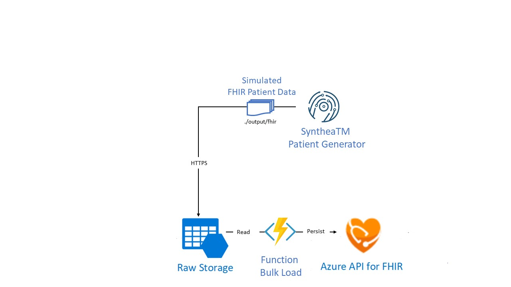

# Challenge 1: Extract, transform and load patient data

[< Previous Challenge](./Challenge00.md) - **[Home](../readme.md)** - [Next Challenge>](./Challenge02.md)

## Introduction

In this challenge, you will implement the FHIR Server Bulk Import to ingest patient data from Electronic Health Record (EHR) systems.  

For unit testing, you will simulate patient records using open source Synthea Patient Generator tool and bulk load them to FHIR Server (PaaS scenario) as depicted in bulk load data flow (red) diagram below.

## Description

- Deploy FHIR Server for data ingestion and transformation of FHIR patient data.
- Auto-generate simulated patient data using **[SyntheaTM Patient Generator](https://github.com/synthetichealth/synthea#syntheatm-patient-generator)**.
   - SyntheaTM is a Synthetic Patient Population Simulator that outputs synthetic patient data and associated health records in FHIR and C-CDA formats to its ./output folder.
- Deploy **[FHIR Server sample (PaaS scenario) Bulk Import components](https://github.com/microsoft/fhir-server-samples)** to load Synthea generated FHIR patient bundle data into FHIR Server.

   Note: In the Azure API for FHIR (PaaS scenario) deployments depicted above, a storage account will be deploy and in this storage account there is a BLOB container called fhirimport, patient bundles generated with Synthea can dumped in this storage container and they will be loaded into the FHIR server. The bulk load is performed by an Azure Function.

   - First, clone this 'FHIR Server Samples' git repo to your local project repo, i.e. c:/projects.

   - Deploy FHIR Server Samples Function Bulk Load and Storage fhirimport via deployment template (azuredeploy-importer.json) in fhir-server-samples/deploy/templates.
- Copy Synthea generated FHIR patient bundle data files to fhirimport Blob container.  This will trigger a function app to bulk load them into FHIR Server.
   - You can **[copy data to Azure Storage using Azure AzCopy via commandline](https://docs.microsoft.com/en-us/azure/storage/common/storage-use-azcopy-v10)**
   - Alternatively, you can **[copy data to Azure Storage using Azure Storage Explorer UI](https://docs.microsoft.com/en-us/azure/storage/common/storage-use-azcopy-v10#use-azcopy-in-azure-storage-explorer)**.  
   - Setup Postman to access patient data inserted into FHIR Server.

## Success Criteria

   - You have provisioned FHIR Server PaaS scenario (Azure API for FHIR) in Azure.
   - You have auto generated test FHIR patient data and loaded them into FHIR Server.
   - Validate FHIR patient data loaded in FHIR Server by retrieving them in Postman

## Learning Resources

- **[Create Mock Data Server in Azure Function](https://medium.com/@hharan618/create-your-own-mock-data-server-in-azure-functions-7a93972fbfd1)**
- **[Azure API for FHIR samples](https://github.com/microsoft/fhir-server-samples)**
- **[Azure FHIR Importer Function](https://github.com/microsoft/fhir-server-samples/tree/master/src/FhirImporter)**
- **[Synthea Patient Generator](https://github.com/synthetichealth/synthea#syntheatm-patient-generator)**
- **[Synthea wiki](https://github.com/synthetichealth/synthea/wiki)**
- **[Copy data to Azure Storage using Azure AzCopy tool](https://docs.microsoft.com/en-us/azure/storage/common/storage-use-azcopy-v10)**
- **[Copy data to Azure Storage using Azure Storage Explorer](https://docs.microsoft.com/en-us/azure/storage/common/storage-use-azcopy-v10#use-azcopy-in-azure-storage-explorer)** 
