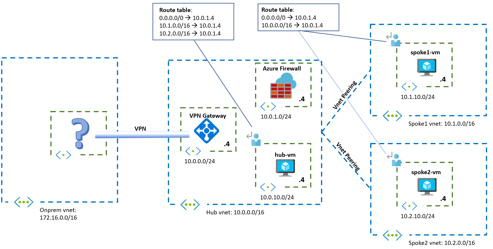

# Challenge 3: Troubleshooting routing

[< Previous Challenge](./02-AzFW.md) - **[Home](README.md)** - [Next Challenge >](./04-AppGW.md)

## Introduction

In this challenge you will diagnose a hub and spoke configuration.

## Description

After challenge 2, the Azure Firewall is inspecting most of the flows. As additional requirement, traffic between a VMs in any spoke and a VM in the hub should be inspected by the firewall. A colleague of yours has implemented the route tables described in the diagram below:

Start by deploying the configuration recommended by your colleague, and verify that flows between spoke1-vm/spoke2-vm and hub-vm indeed traverse the firewall.

Do you see any problem with this configuration? Has any of the flows that were initially configured been impaired?

## Success Criteria

1. The Azure Firewall should inspect traffic between VMs in the hub and any spoke
1. Web server connectivity to all VMs from the public Internet should still be fully functional

## Related documentation

* [What is Azure Firewall](https://docs.microsoft.com/azure/firewall/overview)
