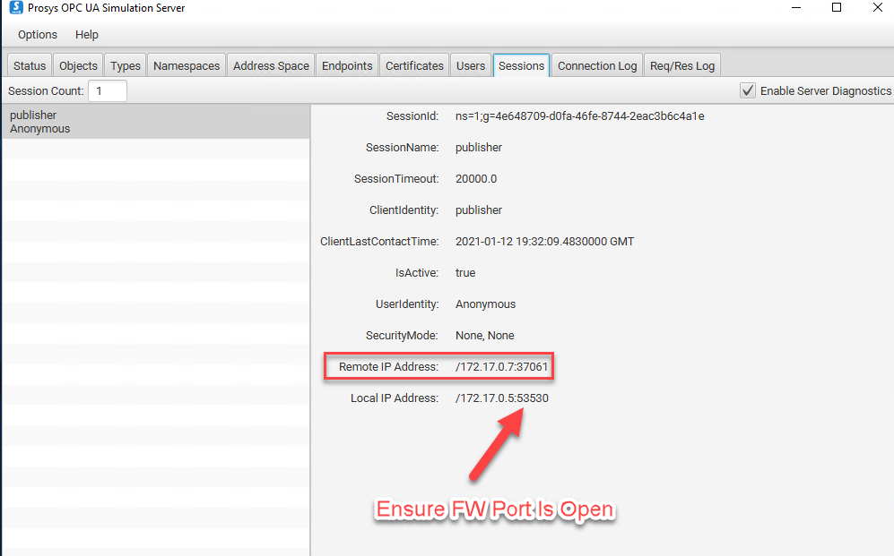

# Challenge 2: Deploy OPC Simulator

**[Home](README.md)** - [Next Challenge >](./Challenge-03.md)

## Success Criteria
Verify challengers have performed the following:

1. Created an OPC server that can be used to simulated data flow from the 'plant floor'
1. Describe security requirements needed to connect to the OPC server

* * *
For this module to be successful, participants must have the following tasks completed:
1. Creation of an OPC server (running on a VM) or the PLC Simulator running as an Azure container instance
1. Explanation of the addresses that will be used on the Edge to connect into the OPC server
1. Validation of any ports (if a VM is used or private network with ACI) will need to be opened to allow OPC connectivity to work from the Edge
1. Explanation of how the participants intend to secure the solution aligned with a typical manufacturing plant [Review some notes on the Purdue model and ISA-95](https://www.automationworld.com/factory/iiot/article/21132891/is-the-purdue-model-still-relevant)
* * * 

## Tips (optional)

### If using the ProSys OPC Server:
You can see the endpoint by opening the service

If you need to troubleshoot whether or not the IoT Edge Is connecting, you can open the utility in 'expert' mode and verify there's a session from the IoT Edge device:

When configuring the Iot Edge OPC Module, you will need to have the node-IDs of data-points you wish to capture.  The simulated values would work to pacify the Hack with elements for feeding into TSI.  Participants can select which values they want to use as all of the simulated values would drive subsequent modules
    
* * *
### The Microsoft PLC Simulator:
Easy mechanism to deploy this container into Azure w/o a VM is with a Container Instance as follows.  Ensure it's in the same region as the IoT Edge to eliminate egress.  You can also use the ARM template on the link above or the [one in the coaches folder to deploy](./assets/aci_plc_sim.json)  

The deployment configuration allows you to specify the quantity of slow/fast changing values that will be used on the IoT Edge OPC modules.

If deploying manually, ensure port is 50000 opened as outlined in the documentation above.

## Advanced Challenges (Optional)