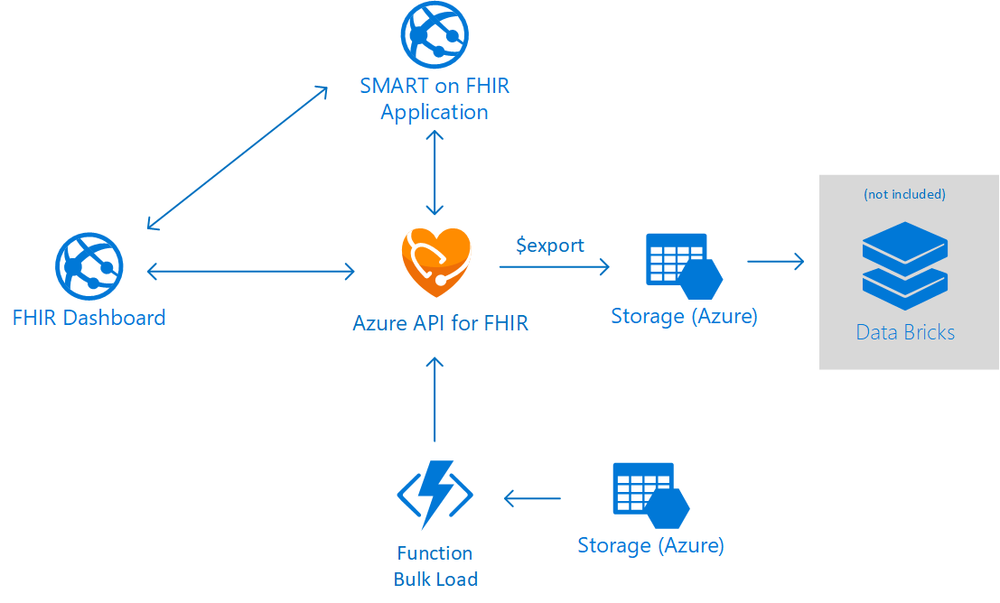

# Coach's Guide: Challenge 1 - Extract, transform and load patient data

[< Previous Challenge](./Solution00.md) - **[Home](./readme.md)** - [Next Challenge>](./Solution02.md)

# Notes & Guidance

## Configure FHIR server
- Create a new service principal
    - Run $ az ad sp create-for-rbac -o json
    - Copy "appid" and "password" from output for use later
    - Find "objectid" of this new Service Principal
        - Run $ az ad sp show --id {appId of the new SP} -o json | jq -r . objectId
        Note: You need to install jq on Windows beforehand - run in PowerShell https://chocolatey.org/packages/jq, 
        i.e. Run $ choco install jq
- Deploy ARM template for the new FHIR service
    - Create resource group in "NorthCentralUS" (supported region for FHIR service preview)
        - Run $ az group create --name myRG --location northcentralus
    - Run the template and use the "objectId" from above,
        - Run $ az group deployment create --template-file azuredeploy.json --parameters azuredeploy.parameters.json --parameters accessPolicyObjectId={objectId of SP} -g Athena-Hack --no-wait
        Note: Need to update azuredeploy.parameters.json file to use all lower case name value, i.e. "myserver".
        - Monitor deployment progress from "Deployments" blade of the resource gorup

## API Load Option: Auto generate test FHIR patient data via serverless function
### Configure the node.js data generation app
- We’ll be adding a new configuration section to the “config.json” file.
- Copy and paste one of the pre-existing environments and change values that are different from the “default” configuration. Typically, these values include:
    - “tenant”: The Azure AD tenant in which you created the service principal above > microsoft.onmicrosoft.com , tenant id: 72f988bf-86f1-41af-91ab-2d7cd011db47
    - “applicationId”: The “appId” value we saved during the creation of the service principal. > e8105de9-72f7-46ef-b787-e2be47a325d0
    - “clientSecret”: The “password” value we saved during the creation of the service principal. > 766268ed-a688-43f5-a0ff-d6ad24f27a74
- “fhirApiUrl”: The URL to the FHIR service created above. You can find this on the Overview blade of the Azure API for FHIR resource under FHIR metadata endpoint or go to https://{yourfhirserverurl}/metadata

### (Optional) Setup Postman to access FHIR API
- Configure Postman Global VAR Environment, i.e. "Azure API for FHIR Env", and include the following variables:
    - tenant_id: {yourtenantid}
    - grant_type: client_credentials
    - client_id: {yourclientidforpostman}
    - client_secret: {yourclientsecretforpostman}
    - resource: http://management.azure.com
    - subscriptionid: {yoursubscriptionid}
- Create Postman collection for FHIR API that configure the following http requests:
    - AuthorzeGetToken - Get New Access Token
        - HTTP Request: 
            - Type=POST 
            - URL=https://login.microsoftonline.com/{{tenantId}}/oauth2/token
        - Auth
            - Type=OAuth 2.0
        - Headers
            - Content-Type: application/x-www-form-urlencoded
        - Body
            - grant_type: client_credentials
            - client_id: {{clientId}}
            - client_secret: {{clientSecret}}
            - resource: {{resource}}
### Run the data generation app to insert auto-generated test patient records
- Download all dependencies
    - Run $ npm install at the root folder of the project working directory.
- Setting NODE_ENV
    - Run $ Set NODE_ENV=<environmentname>
- (Optional) Install npm module dotenv to configure environment via .env file
    - Create ".env" file in project directory with the following content: "NODE_ENV=richard1"
    - Install dotenv npm module
        - Run $ npm install dotenv --save
- Install FHIR npm library
    - Run $ npm install fhir
- Run the datagen.js app to loop and create endless # of patients.  Press Ctrl-C when enough records have been created
    - First, set environment to {yourenvname} in config.json
        - Run $ Set NODE_ENV={yourenvname}
    - Run $ node datagen.js 
- Test datagen.js app to make sure new patient records can be read
    - Run $ node dataread.js
    Note: These recrods are read in pages of 100 at a time

We’re now finished, make sure there at least 10,000 patient records in the server before starting the next challenge.

## Bulk Load Option: Auto generate FHIR patient data via SyntheaTM Patient Generator

### **[SyntheaTM Patient Generator](https://github.com/synthetichealth/synthea#syntheatm-patient-generator)**
- SyntheaTM is a Synthetic Patient Population Simulator. The goal is to output synthetic, realistic (but not real), patient data and associated health records in a variety of formats.

Read our wiki (see link below) for more information.
https://github.com/synthetichealth/synthea/wiki

### **[Developer Quick Start](https://github.com/synthetichealth/synthea#developer-quick-start)**
### **[Installation](https://github.com/synthetichealth/synthea#installation)**
- System Requirements: SyntheaTM requires Java 1.8 or above.
- Clone the SyntheaTM repo, then build and run the test suite:
    - $ git clone https://github.com/synthetichealth/synthea.git
    - $ cd synthea
    - $ ./gradlew build check test

### **[Changing the default properties](https://github.com/synthetichealth/synthea#changing-the-default-properties)**
- The default properties file values can be found at src/main/resources/synthea.properties. By default, synthea does not generate CCDA, CPCDA, CSV, or Bulk FHIR (ndjson). You'll need to adjust this file to activate these features. See the **[wiki](https://github.com/synthetichealth/synthea/wiki)** for more details.

### **[Generate Synthetic Patients](https://github.com/synthetichealth/synthea#generate-synthetic-patients)**
- Generating the population one at a time...
    - $ ./run_synthea
- Command-line arguments may be provided to specify a state, city, population size, or seed for randomization.
    - Usage is:
    - run_synthea [-s seed] [-p populationSize] [-m moduleFilter] [state [city]]
    - For example:
        - run_synthea Massachusetts
        - run_synthea Alaska Juneau
        - run_synthea -s 12345
        - run_synthea -p 1000
        - run_synthea -s 987 Washington Seattle
        - run_synthea -s 21 -p 100 Utah "Salt Lake City"
        - run_synthea -m metabolic*
    - Note: Some settings can be changed in ./src/main/resources/synthea.properties.
- SyntheaTM will output patient records in C-CDA and FHIR formats in ./output.

### **[FHIR Server sample for Bulk Load](https://github.com/microsoft/fhir-server-samples)**
- In both FHIR Server for Azure (open source) and the Azure API for FHIR (PaaS) deployments depicted below, a storage account will be deploy and in this storage account there is a BLOB container called fhirimport, patient bundles generated with Synthea can dumped in this storage container and they will be ingested into the FHIR server. The bulk ingestion is performed by an Azure Function.
- Azure API for FHIR PaaS server:
   - 

