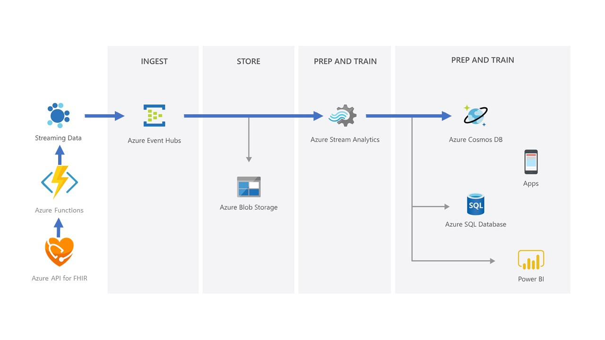

# Coach's Guide: Challenge 3 - Stream patient data with event-driven architecture

[< Previous Challenge](./Solution02.md) - **[Home](./readme.md)** - [Next Challenge>](./Solution04.md)

# Notes & Guidance

## Deploy Azure Event Hubs
**[Serverless streaming with Event Hubs](https://azure.microsoft.com/en-us/services/event-hubs/#features)** architecture to build an end-to-end serverless streaming platform (depicted below).  In sample architecture below, the data flow in blue shows a serverless function retrieves patient data from FHIR Server and drops them to Event Hubs, and then a Stream Analytics job ingests patient data from Event Hubs and writes stream processing results as JSON output to Cosmos DB.


- **[Quickstart: Deploy Azure Event Hubs](https://github.com/Azure/azure-quickstart-templates/tree/master/201-event-hubs-create-event-hub-and-consumer-group/)**
- Install @azure/event-hubs npm module, run:
    `
    $ npm install @azure/event-hubs
    `


## Update Azure Function to read from FHIR server and drop to Eventhub
- Client creation
The simplest usage is to use the static factory method EventHubClient.createFromConnectionString(_connection-string_, _event-hub-path_). Once you have a client, you can use it for:
    - Sending events
    - You can send a single event using client.send() method.
    - You can even batch multiple events together using client.sendBatch() method.

- Receiving events
    - There are two ways to receive events using the EventHub Clien

- Send an event with partition key:

```
const { EventHubClient, EventPosition } = require('@azure/event-hubs');

const client = EventHubClient.createFromConnectionString(process.env["EVENTHUB_CONNECTION_STRING"], process.env["EVENTHUB_NAME"]);

async function main() {
  // NOTE: For receiving events from Azure Stream Analytics, please send Events to an EventHub where the body is a JSON object.
  // const eventData = { body: { "message": "Hello World" }, partitionKey: "pk12345"};
  const eventData = { body: "Hello World", partitionKey: "pk12345"};
  const delivery = await client.send(eventData);
  console.log("message sent successfully.");
}

main().catch((err) => {
  console.log(err);
});

- Send multiple events as a batch
const { EventHubClient, EventPosition } = require('@azure/event-hubs');

const client = EventHubClient.createFromConnectionString(process.env["EVENTHUB_CONNECTION_STRING"], process.env["EVENTHUB_NAME"]);

async function main() {
  const datas = [
    { body: "Hello World 1", applicationProperties: { id: "Some id" }, partitionKey: "pk786" },
    { body: "Hello World 2" },
    { body: "Hello World 3" }
  ];
  // NOTE: For receiving events from Azure Stream Analytics, please send Events to an EventHub
  // where the body is a JSON object/array.
  // const datas = [
  //   { body: { "message": "Hello World 1" }, applicationProperties: { id: "Some id" }, partitionKey: "pk786" },
  //   { body: { "message": "Hello World 2" } },
  //   { body: { "message": "Hello World 3" } }
  // ];
  const delivery = await client.sendBatch(datas);
  console.log("message sent successfully.");
}

main().catch((err) => {
  console.log(err);
});
```

- Deploy new Azure Function triggered by Event Hub pushing data to CosmosDB
