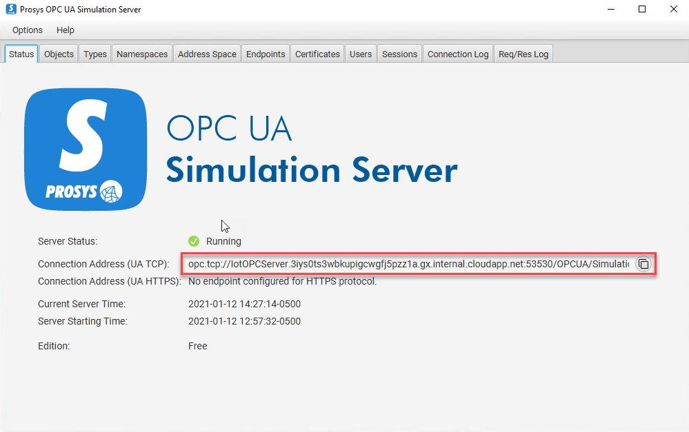
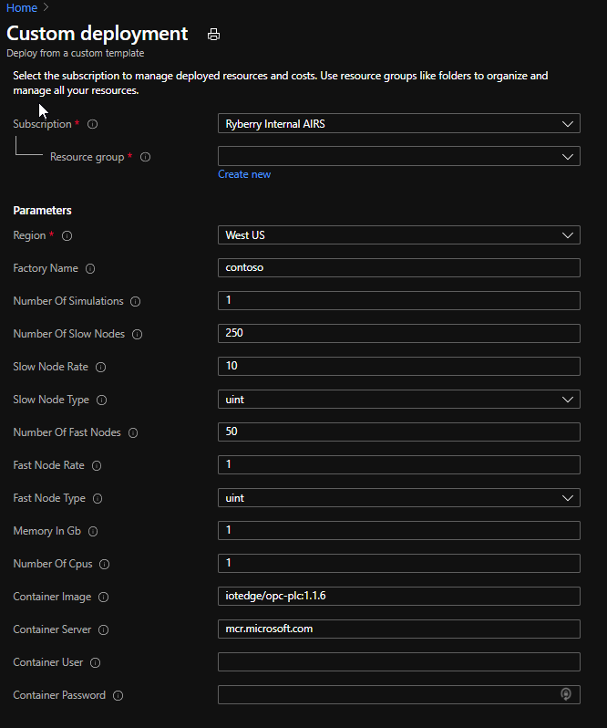

# Challenge 2: Deploy OPC Simulator

**[Home](../README.md)** - [Next Challenge >](./Challenge-03.md)

## Learning Resources
 - Options for OPC Simulators -- first 2 are VM-based options
 1. [ProsysOPC UA Simulator](https://www.prosysopc.com/) -Free and supports many simulated endpoints
 1. [Software ToolBox Top OPC Server](https://www.softwaretoolbox.com/) - Demo can run for 2 hours
 1. [Microsoft OPC PLC Simulator](https://github.com/Azure-Samples/iot-edge-opc-plc)  - Easiest and requires no registration; but doesn't align with a typical customer deployment involving OPC software.  This can be deployed as an Azure Container Instance Endpoint that IoT Edge can be pointed at.
 [Additional details and instructions](https://docs.microsoft.com/en-us/samples/azure-samples/iot-edge-opc-plc/azure-iot-sample-opc-ua-server/)

## Tips (optional)
### If using the ProSys OPC Server:
You can see the endpoint by opening the service

If you need to troubleshoot whether or not the IoT Edge Is connecting, you can open the utility in 'expert' mode and verify there's a session from the IoT Edge device:

When configuring the Iot Edge OPC Module, you will need to have the node-IDs of data-points you wish to capture.  The simulated values would work to pacify the Hack with elements for feeding into TSI.  Participants can select which values they want to use as all of the simulated values would drive subsequent modules
    
* * *
### The Microsoft PLC Simulator:
Image versions are [posted here](https://mcrflowprodcentralus.data.mcr.microsoft.com/mcrprod/iotedge/opc-plc?P1=1610482034&P2=1&P3=1&P4=CswLo%2F%2B8A3qDWT2fu5tbMM8MQhBFTPI1Datu8g7VHV0%3D&se=2021-01-12T20%3A07%3A14Z&sig=ZUawNjtnHG4rnQw9F9tsCjMDOg2RobQHAVzPKDFocbM%3D&sp=r&sr=b&sv=2015-02-21)

Easy mechanism to deploy this container into Azure w/o a VM is with a Container Instance as follows.  Ensure it's in the same region as the IoT Edge to eliminate egress.  You can also use the ARM template on the link above or the [one in the coaches folder to deploy](../assets/aci_plc_sim.json)

The deployment configuration allows you to specify the quantity of slow/fast changing values that will be used on the IoT Edge OPC modules.

If deploying manually, ensure port is 50000 opened as outlined in the documentation above.

## Advanced Challenges (Optional)